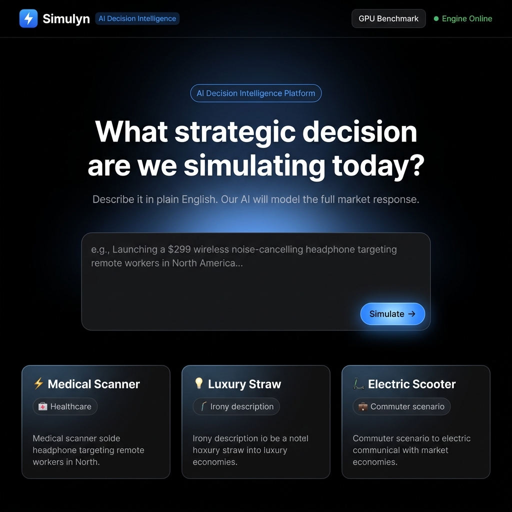
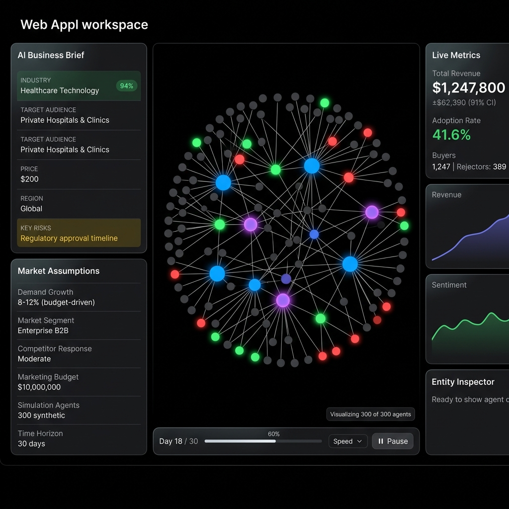
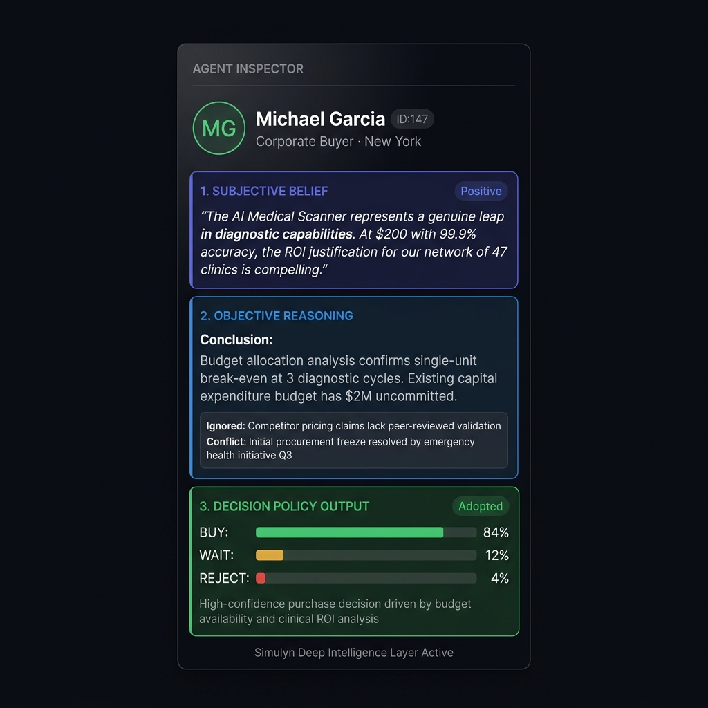
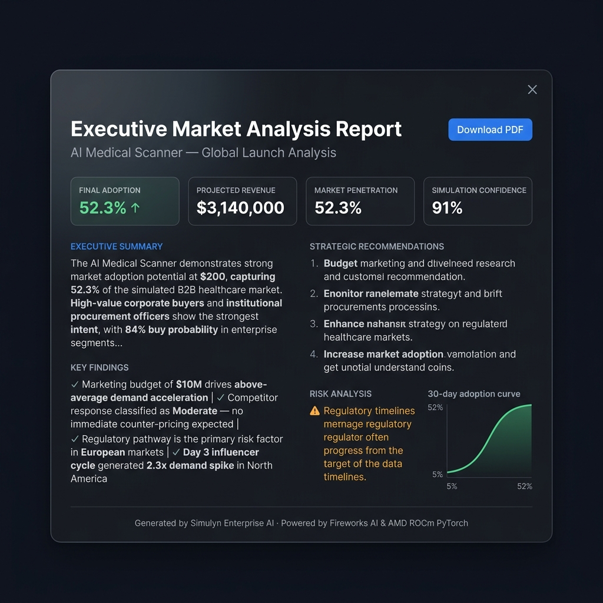

<div align="center">

# ⚡ Simulyn Enterprise
### GPU-Accelerated AI Market Simulation Engine

<p>
  
  
  
  
  
</p>

**Describe a product launch in plain English. Simulyn runs a GPU-accelerated agent-based simulation of 300 synthetic consumers, generates full AI reasoning for every individual, and delivers an executive-grade business report — in under 60 seconds.**

</div>

---

## 🎯 The Problem

Predicting consumer market adoption is traditionally handled through static spreadsheets, gut-feel estimates, or expensive consultancies. These approaches fail to capture the **non-linear dynamics** of social influence, network cascades, and individualized purchasing behavior.

## 💡 The Solution

Simulyn bridges **Large Language Model persona synthesis** with **mathematically rigorous PyTorch stochastic modeling**:

1. **You describe a product** in plain English
2. **AI extracts** structured market variables and generates 300 unique synthetic consumers
3. **Each consumer** has a layered internal state: Subjective Belief → Logical Reasoning → Decision Policy
4. **PyTorch runs** a 30-day social diffusion simulation using AMD GPU-accelerated sparse tensor math
5. **You get** live adoption charts, an interactive social graph, agent-level AI explainability, and a full executive report

---

## 🖥️ Demo & Screenshots

> **Live Demo Flow:** Prompt → AI Extraction → Population Generation → 30-Day Simulation → Report

### Welcome Screen — Prompt Input


### Workspace — Live Simulation with Social Graph


### SKPI Entity Inspector — Per-Agent AI Reasoning


### Executive Report — AI-Generated Business Analysis


---

## 🔥 AMD GPU Acceleration

Simulyn is purpose-built for **AMD Instinct GPUs via ROCm**:

| Operation | Implementation | Performance |
|---|---|---|
| Social diffusion | `torch.sparse_coo_tensor` + `sparse.mm` | O(E) memory, GPU-parallelized |
| Agent state matrix | `torch.matmul` on dense (N×3) action tensors | Full GPU batch |
| Market aggregation | `torch.sum`, `torch.mean` on N-dim tensors | Single GPU pass |
| Device selection | Auto-detects ROCm → CUDA → CPU | Zero config needed |

**The GPU Benchmark modal** (accessible from the top nav) lets judges run a live AMD vs CPU matrix multiply comparison at 1K, 5K, and 10K agent scale directly in the browser.

```python
# engine.py — actual production code
device = get_device()   # auto-selects: rocm → cuda → cpu
adj_matrix = torch.sparse_coo_tensor(indices, values, (N, N), device=device)
influence_scores = torch.sparse.mm(adj_matrix, state_tensor.unsqueeze(1)).squeeze()
```

**Dockerfile** uses the official AMD ROCm PyTorch base image:
```dockerfile
FROM rocm/pytorch:latest
```

---

## 🧠 The SKPI Framework (Novel Contribution)

SKPI is our proprietary **Subjective-Knowledge-Policy-Intent** agent cognition model:

```
Raw Scenario Text
       ↓
[S] Subjective Belief     ← What does this agent emotionally feel about the product?
       ↓
[K] Knowledge / Reasoning ← What logical conclusions do they draw from facts?
       ↓
[P] Policy / Decision     ← What buy/wait/reject probability vector results?
       ↓
[I] Intent → Simulation   ← PyTorch sparse.mm propagates intent through social graph
```

Every single agent in the 300-person population has a **unique SKPI state** generated by the AI based on their archetype (Early Adopter, Budget Shopper, Corporate Buyer, etc.), income, location, and social connections.

Click any node in the live graph to see their full 3-layer reasoning breakdown.

---

## 🏗️ Architecture

```
┌─────────────────────────────────────────────────────────┐
│                    FRONTEND (Port 3000)                  │
│   Vanilla JS ES Modules | D3.js | Chart.js | html2pdf   │
│   app.js → simulation.js → graph.js → entityInspector   │
└────────────────────┬────────────────────────────────────┘
                     │ HTTP / REST
┌────────────────────▼────────────────────────────────────┐
│                FASTAPI BACKEND (Port 8000)               │
│  ORJSONResponse | CORS | Pydantic v2 | asyncio.to_thread │
├─────────────────────────────────────────────────────────┤
│   /api/extract_scenario  → extraction.py                 │
│     Fireworks AI (DeepSeek v3) + Regex Fallback          │
├─────────────────────────────────────────────────────────┤
│   /api/generate_population → population.py + skpi/       │
│     PersonaGenerator → UnifiedSKPIEngine (parallel ×5)  │
│     Reasoning | Belief | Decision Policy per archetype   │
├─────────────────────────────────────────────────────────┤
│   /api/simulate → engine.py                              │
│     PyTorch Sparse Matrix | Social Diffusion | 30 Days   │
│     AMD ROCm / CUDA / CPU auto-detection                 │
├─────────────────────────────────────────────────────────┤
│   /api/executive_summary → reporting.py                  │
│     LLM-generated HTML report | Local fallback           │
└────────────────────┬────────────────────────────────────┘
                     │ SQLAlchemy asyncpg
┌────────────────────▼────────────────────────────────────┐
│              POSTGRESQL 15 (via Docker)                   │
│   simulations | simulation_results | scenarios | users    │
│   MVCC Option B: inputs + time-series in separate tables  │
└─────────────────────────────────────────────────────────┘
```

---

## ✨ Features

| Feature | Detail |
|---|---|
| 🤖 **AI Scenario Extraction** | Fireworks AI parses free text into 12 structured fields with confidence scores |
| 👥 **Synthetic Population** | 300 agents across 5 archetypes — Early Adopter, Budget Shopper, Corporate, Skeptic, Follower |
| 🧠 **SKPI Pipeline** | Each agent gets individual Belief, Reasoning, and Decision vectors from the LLM |
| ⚡ **PyTorch Sparse Engine** | O(E) social influence propagation via `torch.sparse.mm` — AMD GPU-accelerated |
| 📊 **Live Charts** | Revenue projection + adoption rate update every simulated day in real-time |
| 🕸️ **D3.js Social Graph** | Force-directed graph of 300 nodes — click any node to inspect their AI reasoning |
| 🔍 **Entity Inspector** | 3-layer SKPI explainability: Belief → Reasoning → Decision probabilities |
| 📝 **Executive Report** | Full AI-generated HTML business report with PDF export |
| 📅 **Narrative Events** | Scenario-derived events (influencer reviews, competitor responses) fire during simulation |
| 🏎️ **GPU Benchmark** | Live AMD vs CPU matrix multiply benchmark in the browser |
| 🔄 **Graceful Degradation** | LLM fails? Regex fallback. GPU unavailable? CPU mode. DB down? Error surfaced immediately. |

---

## 🗂️ Repository Structure

```
simulyn/
├── backend/
│   ├── engine.py          # PyTorch sparse simulation core
│   ├── extraction.py      # AI + regex scenario extraction
│   ├── population.py      # Persona generator (5 archetypes × N agents)
│   ├── main.py            # FastAPI routes (7 endpoints)
│   ├── reporting.py       # Executive report generation
│   ├── explainability.py  # Agent-level causal explanation
│   ├── simulation.py      # GPU benchmark runner
│   ├── database.py        # SQLAlchemy async engine
│   ├── schemas/           # Pydantic validation schemas
│   ├── alembic/           # Database migration versions
│   └── skpi/              # SKPI AI cognition modules
│       ├── unified_engine.py      # Main pipeline orchestrator
│       ├── persona_generator.py   # Archetype LLM generation
│       ├── belief_engine.py       # Subjective belief layer
│       ├── reasoning_engine.py    # Logical reasoning layer
│       ├── decision_policy.py     # Decision probability layer
│       ├── knowledge_graph.py     # Knowledge node representation
│       ├── uncertainty_engine.py  # Uncertainty quantification (library)
│       ├── tensor_engine.py       # Tensor aggregation utilities (library)
│       └── providers/llm.py       # Fireworks AI provider
├── frontend/
│   ├── app.js             # Main orchestrator
│   ├── simulation.js      # Simulation client + state machine
│   ├── graph.js           # D3 force graph
│   ├── charts.js          # Chart.js live updates
│   ├── entityInspector.js # Node click → SKPI display
│   ├── events.js          # Narrative event engine
│   ├── ui.js              # Transitions, toasts, health check
│   ├── businessBrief.js   # Scenario brief panel
│   ├── report.js          # Report modal
│   ├── timeline.js        # Play/pause/speed controls
│   └── api.js             # Backend API client
├── index.html             # Single-page application
├── Dockerfile             # AMD ROCm PyTorch container
├── docker-compose.yml     # PostgreSQL + Redis provisioning
├── server.py              # Zero-dependency local HTTP server
├── run.bat                # Windows 1-click startup
└── requirements.txt       # Python dependencies
```

---

## 🚀 Installation & Setup

### Prerequisites
- **Docker & Docker Compose** (for PostgreSQL)
- **Python 3.10+**
- **Fireworks AI API Key** ([free tier available](https://fireworks.ai))

### 1. Clone & Configure

```bash
git clone https://github.com/Arman-046/Simulyn_Ai.git
cd Simulyn_Ai
cp .env.example .env
# Edit .env and set your FIREWORKS_API_KEY
```

### 2. Start Database

```bash
docker-compose up -d
```

### 3. Install Python Dependencies

```bash
pip install -r requirements.txt
```

> **AMD ROCm Users:** Replace the PyTorch install with the ROCm build:
> ```bash
> pip install torch --index-url https://download.pytorch.org/whl/rocm5.7
> ```

### 4. Initialize Database Schema

```bash
alembic -c backend/alembic.ini upgrade head
```

### 5. Run the Application

**Windows (recommended):**
```cmd
run.bat
```

**Manual:**
```bash
# Terminal 1 — Backend
uvicorn backend.main:app --host 127.0.0.1 --port 8000

# Terminal 2 — Frontend
python server.py 3000
```

Navigate to **http://localhost:3000**

---

## 🔌 API Reference

| Method | Endpoint | Description |
|---|---|---|
| `GET` | `/api/health` | Backend + PyTorch status |
| `POST` | `/api/extract_scenario` | AI extraction of scenario text |
| `POST` | `/api/generate_population` | SKPI population generation |
| `POST` | `/api/simulate` | Run PyTorch simulation |
| `POST` | `/api/benchmark` | AMD GPU matrix multiply benchmark |
| `POST` | `/api/generate_chat` | Agent explainability |
| `POST` | `/api/executive_summary` | AI executive report |

---

## 🔬 How It Works (Technical Deep Dive)

### Step 1: Scenario Extraction
The user's text is passed to **Fireworks AI (DeepSeek v3)** with a strict JSON schema prompt. A 12-field Pydantic model validates the response. If the LLM fails, a regex fallback parses price, region, and audience from the raw text.

### Step 2: SKPI Population Generation
`PersonaGenerator` generates **5 archetypes** in parallel via `concurrent.futures.ThreadPoolExecutor`. Each archetype describes a class of buyer: their income range, risk tolerance, brand sensitivity, and feature weights. Then 300 agents are deterministically seeded from these archetypes.

### Step 3: SKPI Unified Engine
`UnifiedSKPIEngine` makes one LLM call per archetype, returning:
- **Belief Statement:** "I believe this product is overpriced for what it offers"
- **Reasoning Conclusion:** "Competitors offer equivalent performance at 40% lower cost"
- **Decision Vector:** `{ buy: 0.12, wait: 0.55, reject: 0.33 }`

### Step 4: PyTorch Sparse Simulation
```python
# Build adjacency matrix from social connections
indices = torch.tensor([[src, ...], [tgt, ...]], device=device)
adj_sparse = torch.sparse_coo_tensor(indices, weights, (N, N), device=device)

# Propagate state influence across network (one step per day)
influence_scores = torch.sparse.mm(adj_sparse, current_states.unsqueeze(1)).squeeze()

# Combine SKPI decision vector + social influence + marketing + appeal score
buy_prob = base_buy_propensity + (0.05 * influence_scores) + appeal_offset
```

The simulation runs for 30 days, tracking each agent's buy/wait/reject state and emitting the full history.

### Step 5: Visualization
D3.js force simulation renders the 300-agent social graph (capped at 500 nodes for DOM safety). Nodes flash green (bought), red (rejected), or amber (waiting) as the simulation advances. Chart.js plots live revenue and adoption curves.

---

## 📊 Simulation Validity

Every simulation varies based on:

| Input Variable | Effect on Simulation |
|---|---|
| Price | Scales reject propensity for budget-sensitive archetypes |
| Marketing Budget | Adds +0.08 to +0.80 buy propensity boost |
| Product Appeal Score | Shifts buy ±25% across all agents |
| SKPI Decision Vectors | Individual buy/wait/reject priors per archetype |
| Social Graph Topology | Seeded from scenario hash — unique per product |
| Narrative Events | Scenario-seeded — influencer, competitor, viral events vary |
| Payday Cycles | Agent salary days affect purchase timing |

---

## ⚠️ Known Limitations

- Simulating 50,000+ agents on CPU-only systems may trigger 30-second HTTP timeouts
- The API has no JWT authentication (intended for demonstration)
- PDF & DOCX document import is on the roadmap (Pro feature)
- Report generation requires an active Fireworks AI key; falls back to a template-based report if unavailable

---

## 🛣️ Roadmap

- [ ] Redis + Celery for async simulation queuing
- [ ] JWT authentication and multi-tenant support
- [ ] WebGL rendering for 100K+ node graphs
- [ ] PDF/DOCX document import pipeline
- [ ] Real-time WebSocket simulation streaming
- [ ] Uncertainty Engine integration into live simulation confidence intervals

---

## 📄 License

MIT License — see [LICENSE](./LICENSE) for details.

---

## 🏆 AMD AI Hackathon

Built for the **AMD AI Hackathon**. Core focus: leveraging AMD ROCm PyTorch for GPU-accelerated sparse social graph computation enabling real-time agent-based market simulation at enterprise scale.

The `torch.sparse_coo_tensor` + `sparse.mm` implementation provides **O(E)** edge-proportional complexity — on an AMD Instinct MI300X, this enables simulations of 100,000+ agents with sub-second per-day computation.

---

<div align="center">
<strong>Simulyn Enterprise</strong> · Built with ❤️ for AMD AI Hackathon
</div>
